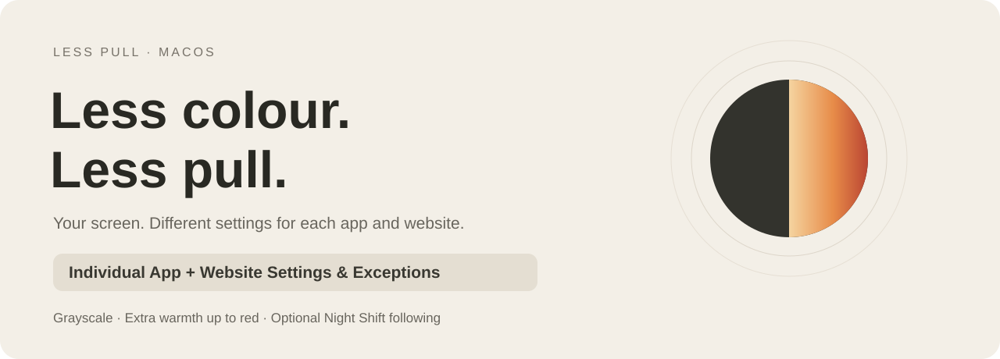
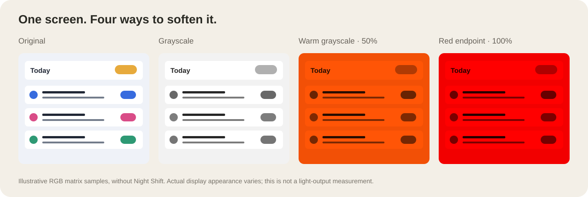
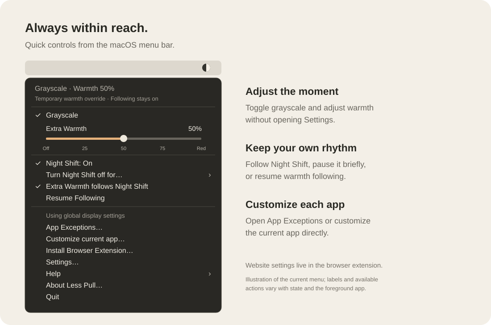
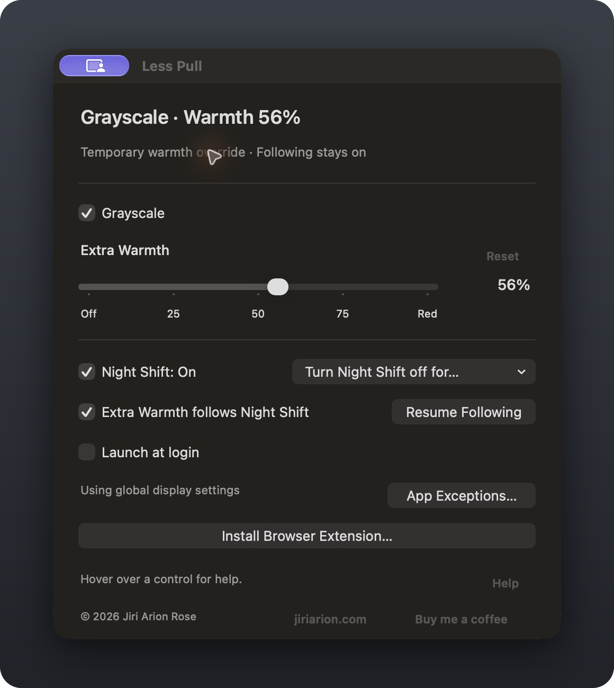

<p align="center"></p>

<p align="center"><strong>A calm macOS menu-bar app by Jiri Arion Rose.</strong><br>Grayscale and optional warmth up to red—with individual settings and exceptions for each app and website.</p>

<p align="center"><a href="https://github.com/Archangeloi89/less-pull/releases/tag/v1.4.4">Download 1.4.4</a> · <a href="docs/INSTALL.md">Install</a> · <a href="docs/LICENSING.md">Licensing</a> · <a href="https://jiriarion.com">About the author</a></p>

## A little less invitation to keep looking

Colour makes a screen lively. Less Pull lets you remove it when you want a quieter place to read, write, or work. Choose global settings, then customize individual apps and websites independently: grayscale on or off, your preferred Extra Warmth, and Night Shift on or off. Each effect can inherit the global setting or use its own exception. Website settings support whole domains or exact URLs through the optional Chrome/Brave extension.

For example, keep writing apps in grayscale, allow colour in a photo editor, and give a particular website its own warmth setting. Rules take effect when their app or tab is in the foreground; they change the appearance across your displays.

Extra Warmth is optional. Use it during the day, in the evening, or let it follow macOS Night Shift. It extends the available warmth through amber all the way to red, progressively reducing the blue channel. The percentage is a relative control, not a Kelvin value or a measured blue-light reduction. Less Pull is designed around personal preference; it makes no medical or sleep-outcome promises.



## Quick controls from the menu bar

Click the Less Pull menu-bar icon to toggle grayscale, adjust Extra Warmth, control or briefly pause Night Shift, and resume warmth following. **App Exceptions…** opens individual app settings; **Customize [current app]…** takes you directly to the foreground app. The menu also provides browser-extension setup, Settings, Help, and Diagnostics.



*Illustration based on the current app menu. Labels, checkmarks, and available actions change with your settings and foreground app. Website exceptions are configured in the browser extension.*

## Global defaults. Individual app and website settings.

<table><tr><td width="48%"></td><td valign="top">

**Grayscale stays your choice.** Night Shift ending never turns it off. App and website exceptions can still override it.

**Warmth has its own rhythm.** Follow Night Shift to remove inherited warmth during the day and restore your saved amount at night. Or leave following off and choose warmth whenever you want.

**Change the moment, keep the schedule.** A manual warmth adjustment temporarily overrides following. Resume Following returns to the current Night Shift state.

**Colour where it matters.** Set independent grayscale, warmth, and Night Shift exceptions for a foreground app, a whole website, or an exact URL.

**A gentle return.** Appearance changes fade over half a second. Reduce Motion uses immediate changes.

</td></tr></table>

*The settings image is an actual app screenshot. The comparison above is an illustrative matrix rendering, not a photograph or an optical measurement.*

## Get started

1. Download the app ZIP from the [1.4.4 release](https://github.com/Archangeloi89/less-pull/releases/tag/v1.4.4), unzip, and move **Less Pull.app** to **Applications**.
2. Open it and choose Grayscale and Extra Warmth. Enable warmth following if you want Night Shift to control warmth timing.
3. For website exceptions, choose **Install Browser Extension…** in the app and follow the [Chrome/Brave setup](docs/INSTALL.md).

Current build: **1.4.4 (15)** · **Apple silicon** · macOS 13+ build target, tested on macOS 27. This is an **ad-hoc signed, unnotarized test build**; Gatekeeper may block downloaded copies. The browser extension is installed locally and has not been store-approved. [Distribution status and remaining validation](docs/RELEASE-PLAN.md).

## Local by design

No account, analytics, or webpage injection. The optional extension uses tab-address access to pass the active public tab to the Mac app through local native messaging. Saved website exceptions stay on this Mac; exact-URL rules can include paths and query strings. Private tabs are excluded. [Privacy details](docs/PRIVACY.md).

## Free to use, including at work

Everyone may use the unmodified app and extension for free, including professionally and in businesses. Source inspection and noncommercial development are permitted. Commercial adaptation, code reuse in commercial products, and sale require the author's written permission.

The [app license](LICENSE-APP.txt) and [source license](LICENSE-SOURCE.txt) govern different rights. This is **source-available with commercial restrictions**. [Permission table and legal-review status](docs/LICENSING.md).

## Development

Objective-C and Apple frameworks; plain JavaScript MV3 extension, with no third-party runtime dependencies. Build on Apple silicon with Apple's Command Line Tools:

```sh
zsh Source/build.sh
```

See [testing instructions](Source/TESTING.txt), [1.4.4 changes](docs/1.4.4-release.txt), and the [release plan](docs/RELEASE-PLAN.md). The app relies on private macOS display interfaces, so compatibility needs validation on each supported OS. Chrome and Brave are implemented; Safari, Firefox, Opera, and Edge ports remain future work.

---

Created by [Jiri Arion Rose](https://jiriarion.com). If Less Pull helps you, [support its development](https://buymeacoffee.com/HsERf62fiZ).
