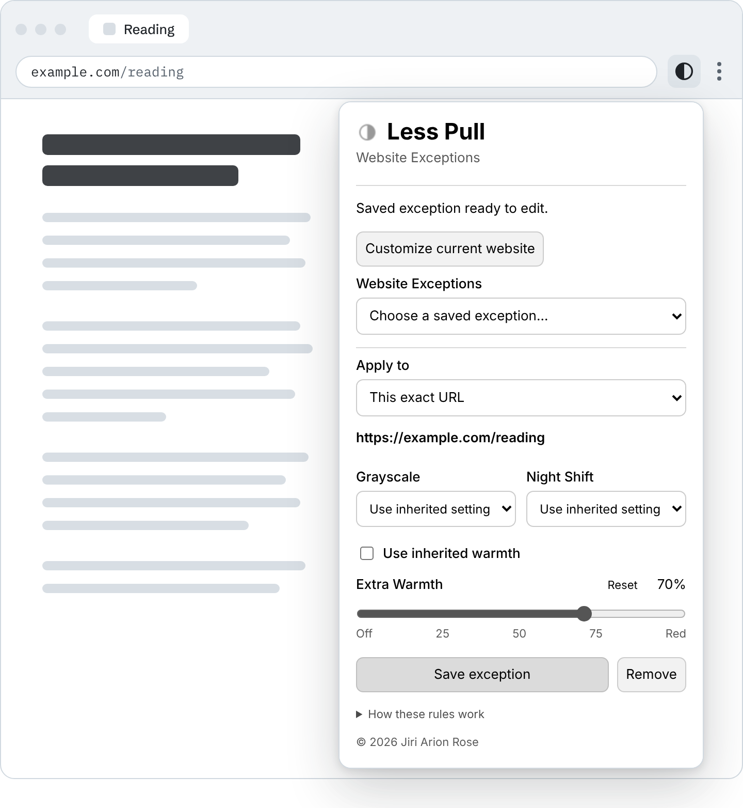

<p align="center">
  <picture>
    <source media="(prefers-color-scheme: dark)" srcset="docs/assets/hero-dark.svg">
    
  </picture>
</p>

<p align="center">
  <a href="https://github.com/Archangeloi89/less-pull/releases/tag/v1.4.4"><b>Download 1.4.4</b></a>
  &nbsp;·&nbsp; <a href="#install">Install</a>
  &nbsp;·&nbsp; <a href="docs/EXCEPTIONS.md">App and website exceptions</a>
  &nbsp;·&nbsp; <a href="docs/README.md">All docs</a>
</p>

Less Pull is a small menu-bar app for macOS by [Jiri Arion Rose](https://jiriarion.com). It takes the color out of your screen so there is a little less reason to keep looking. You can add warmth on top, from a touch of amber all the way to red. And because some things need color, every app and every website can have its own settings.

<sub>The picture above is an illustration, not a screen recording. Its three looks are calculated with the same color matrix the app uses. The apps and the site are examples, not presets.</sub>

## Every app and website can have its own settings

Set your defaults once. Then make exceptions for the places that need something else. Whatever is in front decides how the screen looks, and the change fades in over half a second.

<p align="center">
  <picture>
    <source media="(prefers-color-scheme: dark)" srcset="docs/assets/examples-dark.svg">
    
  </picture>
</p>

<sub>Illustrated examples. Less Pull ships with no presets, so the rules are always yours.</sub>

An exception can be as broad or as narrow as you like:

- **An app.** Add it under **App Exceptions…**, or choose **Customize [current app]…** in the menu to jump straight to the app you are using.
- **A whole website.** A domain rule also covers its subdomains.
- **One exact URL.** For a single page, with its path and query string.

Website rules are set from the toolbar of Brave or Chrome with the [optional extension](#website-exceptions-in-brave-or-chrome).

### Change one thing, keep the rest

An exception does not have to replace everything. Grayscale, Extra Warmth and Night Shift are separate settings. Set the one you want to change, and the others carry over from the broader level.

<p align="center">
  <picture>
    <source media="(prefers-color-scheme: dark)" srcset="docs/assets/levels-dark.svg">
    
  </picture>
</p>

<sub>Example values. App exceptions work the same way: an app keeps whatever its rule does not change.</sub>

A few things to know before you rely on it:

- A rule changes **all your displays** while its app or tab is in front. It does not tint a single window, and it never touches the web page itself.
- An app rule applies while that app is frontmost with a visible window that is not minimized.
- Private browser tabs are never read, so website rules do not apply there.

The [exceptions guide](docs/EXCEPTIONS.md) has the details.

## Grayscale, and warmth from amber to red

**Grayscale** is a checkbox. **Extra Warmth** is a slider that runs from Off to Red, and you can use it with or without grayscale. Higher settings take out more blue and green until only red is left. Color and grayscale arrive at the same red endpoint.

<p align="center">
  <picture>
    <source media="(prefers-color-scheme: dark)" srcset="docs/assets/warmth-dark.svg">
    
  </picture>
</p>

<sub>Illustration calculated from the app's warmth curve. It is not a photograph of a display, and your screen will look somewhat different.</sub>

The percentage is a relative control. It is not a Kelvin value and not a measured reduction in blue light. Less Pull is about what feels calmer to you, and it makes no promises about sleep, eyes or health.

## Night Shift can set the rhythm

Turn on **Extra Warmth follows Night Shift** if you want warmth only at night. While Night Shift is off, the warmth you inherit from your defaults is removed. When Night Shift turns on, your saved amount comes back.

<p align="center">
  <picture>
    <source media="(prefers-color-scheme: dark)" srcset="docs/assets/nightshift-dark.svg">
    
  </picture>
</p>

<sub>Example schedule. Night Shift keeps the schedule you set in macOS.</sub>

- **Following controls warmth only.** Grayscale stays the way you set it, day and night.
- **You can still change the moment.** Moving the slider overrides following until Night Shift next switches, or until you choose **Resume Following**. The new amount is saved for the night.
- **Following is optional.** Leave it off and warmth stays wherever you put it.
- **Night Shift itself is in the menu too.** Turn it on or off, or off for an hour, four hours, or until morning.

More in [Night Shift and warmth](docs/NIGHT-SHIFT.md).

## Where the controls are

Less Pull has two interfaces on the Mac and a third in the browser.

<p align="center">
  
</p>

<sub>Two real screenshots of version 1.4.4, placed side by side on a plain backdrop.</sub>

### The menu bar, for quick changes

Click the half-filled circle in the menu bar. This is the dropdown on the left.

- The first line tells you what is applied right now.
- **Grayscale** and the **Extra Warmth** slider change your defaults.
- **Night Shift** can be switched, or paused for a while.
- **Customize [current app]…** opens the rule for the app you were just using. In this screenshot that app happened to be System Settings.
- **App Exceptions…** lists every app rule.

### The settings window, for everything in one place

Choose **Settings…** in the menu. This is the window on the right.

- The same controls as the menu, with room to breathe.
- **Launch at login**.
- **App Exceptions…**, where you add an app and choose its Grayscale, Night Shift and warmth.
- **Install Browser Extension…** to set up website rules.
- Hover over any control for a short explanation.

### Website exceptions, in Brave or Chrome

Website rules live where you browse. Click the Less Pull icon in the browser toolbar and the popup already knows which site you are on. Choose **Whole domain** or **This exact URL**, set only what you want to change, and save.

<p align="center">
  <picture>
    <source media="(prefers-color-scheme: dark)" srcset="docs/assets/website-popup-dark.png">
    
  </picture>
</p>

<sub>The popup is the shipped extension code, rendered with example data. The browser window around it is a drawing, and menus and sliders look a little different in Brave and Chrome on a Mac.</sub>

The extension tells the Mac app which site is in front, and the app changes the display. It does not inject anything into pages, and the Mac app has to be running. Brave is confirmed working. Chrome is implemented but has not yet been through a clean install test. Safari, Firefox, Edge and Opera are not supported.

## Install

1. Download **Less.Pull.1.4.4.zip** from the [1.4.4 release](https://github.com/Archangeloi89/less-pull/releases/tag/v1.4.4), unzip it, and move **Less Pull.app** to **Applications**.
2. Open it. Click the half-filled circle in the menu bar and choose Grayscale and Extra Warmth.
3. For website rules, choose **Install Browser Extension…** and follow the steps for [Brave or Chrome](docs/INSTALL.md#brave-or-chrome).

> [!NOTE]
> Version 1.4.4 (build 15) is a test build for Apple silicon Macs. It is ad-hoc signed and not notarized by Apple, so Gatekeeper may block a downloaded copy. It is built for macOS 13 and later and has been tested on macOS 27 only. The browser extension is loaded locally and is not in the Chrome Web Store. See [install help](docs/INSTALL.md) and [what is still open](docs/RELEASE-PLAN.md).

## Private by design

No account, no analytics, no cloud sync. The extension reads the address of the active tab, passes it to the app on your Mac, and never reads or changes page content. Private tabs are excluded. Your rules stay on your Mac. [Privacy details](docs/PRIVACY.md).

## Free to use, including at work

Anyone may use the unmodified app and extension for free, at home or in a business. You may read the source and build on it for noncommercial purposes. Commercial adaptation, reuse of the code in commercial products, and sale need the author's written permission.

Less Pull is source-available, not open source. The [app license](LICENSE-APP.txt) and the [source license](LICENSE-SOURCE.txt) are the terms that count, and [the licensing overview](docs/LICENSING.md) summarizes them.

## Build it yourself

The app is Objective-C on Apple frameworks. The extension is plain JavaScript on Manifest V3. Neither has third-party runtime dependencies. On an Apple silicon Mac with Apple's Command Line Tools:

```sh
zsh Source/build.sh
```

See [testing](Source/TESTING.txt), the [1.4.4 notes](docs/1.4.4-release.txt) and the [release plan](docs/RELEASE-PLAN.md). Less Pull relies on private macOS display interfaces, so each macOS version needs its own check.

## Documentation

| Guide | What it covers |
| :-- | :-- |
| [Install](docs/INSTALL.md) | The Mac app, the browser extension, and troubleshooting |
| [App and website exceptions](docs/EXCEPTIONS.md) | Scopes, inheritance, examples and limits |
| [Night Shift and warmth](docs/NIGHT-SHIFT.md) | Following, overrides and timed pauses |
| [Privacy](docs/PRIVACY.md) | What is read, stored and logged |
| [Licensing](docs/LICENSING.md) | What you may do, in a table |
| [Release plan](docs/RELEASE-PLAN.md) | What is verified and what is still open |

---

<p align="center">
  Made by <a href="https://jiriarion.com">Jiri Arion Rose</a>. If Less Pull helps you, you can <a href="https://buymeacoffee.com/HsERf62fiZ">buy me a coffee</a>.<br>
  <sub>© 2026 Jiri Arion Rose</sub>
</p>
