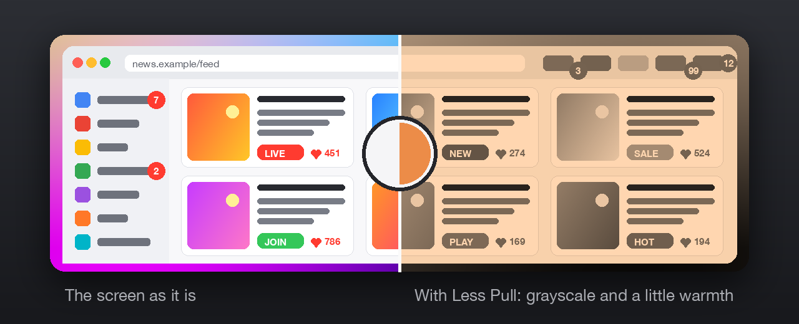
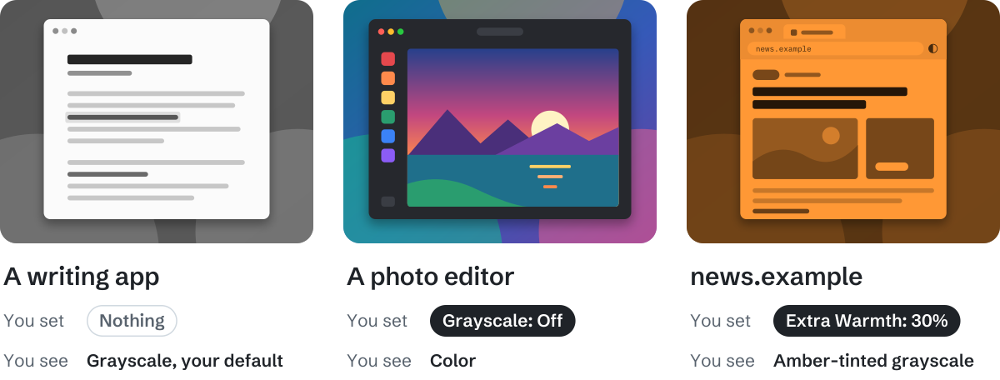
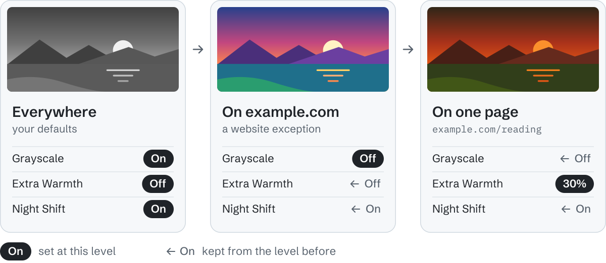
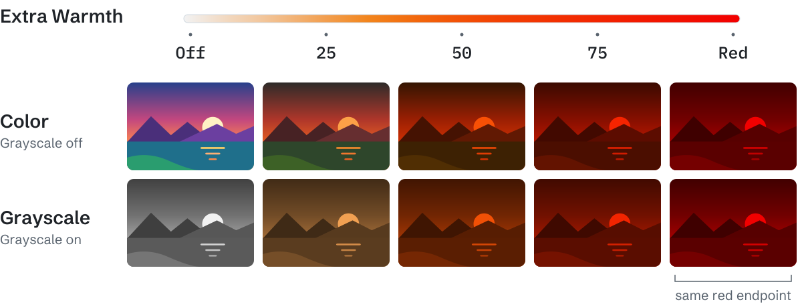
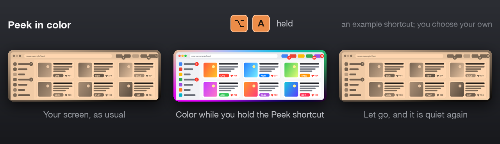
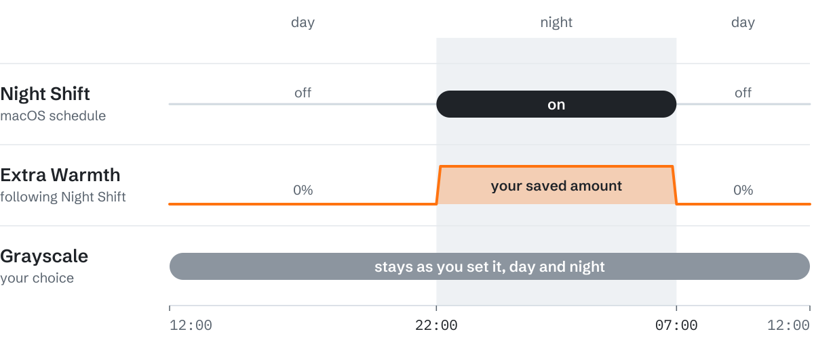

<p align="center">
  <picture>
    <source media="(prefers-color-scheme: dark)" srcset="docs/assets/hero-dark.svg">
    
  </picture>
</p>

<p align="center">
  <a href="https://github.com/Archangeloi89/less-pull/releases/tag/v1.4.4-16"><b>Download build 16</b></a>
  &nbsp;·&nbsp; <a href="#install">Install</a>
  &nbsp;·&nbsp; <a href="docs/EXCEPTIONS.md">App and website exceptions</a>
  &nbsp;·&nbsp; <a href="docs/README.md">All docs</a>
</p>

**A quieter screen.** Less Pull is a small menu-bar app for macOS by [Jiri Arion Rose](https://jiriarion.com). It takes the color out of your screen, so it pulls at you less — a little like stepping out of a loud room into a still one. What matters is still there; it just stops shouting.

Warmth is the second step: from a touch of amber all the way to red, it takes the blue out of the light and puts you back in charge of how your screen speaks to you. And because a few things truly need color, every app and every website can have its own settings.

<sub>The picture above is an illustration, not a screen recording. Its three looks are calculated with the same color matrix the app uses. The apps and the site are examples, not presets.</sub>

## At a glance

- **Grayscale**, on or off, from the menu bar, a shortcut, or a right-click on the icon.
- **Extra Warmth**, a slider from a touch of amber to red, with or without grayscale.
- **[Peek in color](#peek-in-color)**: hold a shortcut and the screen is in color for exactly as long as you hold it. Press it twice to keep it.
- **[Exceptions](#every-app-and-website-can-have-its-own-settings)** for any app, any website or one exact page, set right in the menu.
- **Time off**: Grayscale off for an hour, four hours, or until Night Shift changes; Pause Less Pull for a while.
- **[Night Shift](#night-shift-can-set-the-rhythm)** can set the rhythm, so warmth comes only at night.
- **A menu-bar icon that shows the state**: its left half fills while grayscale is on, its right half warms with the warmth.
- **[Private by design](#private-by-design)**: no account, no analytics, nothing leaves your Mac except an optional daily update check.

## Every app and website can have its own settings

Set your defaults once. Then make exceptions for the places that need something else. Whatever is in front decides how the screen looks, and the change fades in over half a second.

<p align="center">
  
</p>

<sub>Drawn, not a photograph: the right half is computed with the app's own color matrix at an everyday setting.</sub>

<p align="center">
  <picture>
    <source media="(prefers-color-scheme: dark)" srcset="docs/assets/examples-dark.svg">
    
  </picture>
</p>

<sub>Illustrated examples. Less Pull ships with no presets, so the rules are always yours.</sub>

An exception can be as broad or as narrow as you like:

- **An app.** Open **Exception for [current app]** in the menu and set it right there, or add any app under **Settings… → Apps**.
- **A whole website.** A domain rule also covers its subdomains.
- **One exact URL.** For a single page, with its path and query string.

Website rules are set from the same menu once the [optional extension](#website-exceptions-in-your-browser) connects your browser, and listed under **Settings… → Websites**.

### Change one thing, keep the rest

An exception does not have to replace everything. Grayscale, Extra Warmth and Night Shift are separate settings. Set the one you want to change, and the others carry over from the broader level.

<p align="center">
  <picture>
    <source media="(prefers-color-scheme: dark)" srcset="docs/assets/levels-dark.svg">
    
  </picture>
</p>

<sub>Example values. App exceptions work the same way: an app keeps whatever its rule does not change.</sub>

A few things to know before you rely on it:

- A rule changes **all your displays** while its app or tab is in front. It does not tint a single window, and it never touches the web page itself.
- An app rule applies while that app is frontmost with a visible window that is not minimized.
- Private browser tabs are never read, so website rules do not apply there.

The [exceptions guide](docs/EXCEPTIONS.md) has the details.

## Grayscale, and warmth from amber to red

**Grayscale** is a checkbox. **Extra Warmth** is a slider that runs from Off to Red, and you can use it with or without grayscale. Higher settings take out more blue and green until only red is left. Color and grayscale arrive at the same red endpoint.

<p align="center">
  <picture>
    <source media="(prefers-color-scheme: dark)" srcset="docs/assets/warmth-dark.svg">
    
  </picture>
</p>

<sub>Illustration calculated from the app's warmth curve. It is not a photograph of a display, and your screen will look somewhat different.</sub>

The percentage is a relative control. It is not a Kelvin value and not a measured reduction in blue light. Less Pull is about what feels calmer to you, and it makes no promises about sleep, eyes or health.

## Peek in color

Sometimes you need color for a moment: to tell two lines in a chart apart, to check a photo, to find the red button. You do not have to change anything for that. Record a shortcut under **Settings… → Shortcuts** (or let **Suggest** pick a free one), then hold it. The screen is in color for exactly as long as you hold the keys, and quiet again the moment you let go.

<p align="center">
  
</p>

<sub>Drawn with the app's own color matrix. Option-A is an example; Less Pull ships without a shortcut, and Suggest offers one that is free on your Mac.</sub>

- **Press it twice quickly to keep the peek.** The plain display then stays until you press the shortcut once more. Nothing is saved and no exception is made.
- **Choose what peeking turns off.** Grayscale and Extra Warmth by default; Night Shift too, if you like.
- **Toggle Grayscale** is the second shortcut, for switching your default on and off without opening the menu. A right-click on the menu-bar icon does the same.
- **For longer than a moment**, there is **Grayscale off for** an hour, four hours, or until Night Shift next changes, and **Pause Less Pull** for 15 minutes, an hour, or until you resume. Both are in the menu.

## Night Shift can set the rhythm

Turn on **Extra Warmth follows Night Shift** if you want warmth only at night. While Night Shift is off, the warmth you inherit from your defaults is removed. When Night Shift turns on, your saved amount comes back.

<p align="center">
  <picture>
    <source media="(prefers-color-scheme: dark)" srcset="docs/assets/nightshift-dark.svg">
    
  </picture>
</p>

<sub>Example schedule. Night Shift keeps the schedule you set in macOS.</sub>

- **Following controls warmth only.** Grayscale stays the way you set it, day and night.
- **You can still change the moment.** Moving the slider overrides following until Night Shift next switches, or until you choose **Resume Following**. The new amount is saved for the night.
- **Following is optional.** Leave it off and warmth stays wherever you put it.
- **Night Shift itself is in the menu too.** Turn it on or off, or off for an hour, four hours, or until morning.
- **Following, in one sentence.** On: Extra Warmth only while Night Shift is on, none in the daytime. Off: Extra Warmth stays on all day.

More in [Night Shift and warmth](docs/NIGHT-SHIFT.md).

## Where the controls are

Less Pull has two interfaces, both on the Mac: the menu and the Settings window. The browser extension only connects the browser.

<p align="center">
  
</p>

<sub>Two real screenshots of build 16, placed side by side on a plain backdrop. The menu is translucent, so it carries a tint of whatever was behind it.</sub>

### The menu bar, for quick changes

Click the circle in the menu bar (a right-click toggles Grayscale straight away). This is the dropdown on the left. The icon itself tells you the state: its left half fills while grayscale is showing, its right half warms as you add warmth, and it shows a pause mark while Less Pull or Night Shift is paused.

- The first line tells you what is applied right now.
- **Grayscale** and the **Extra Warmth** slider change your defaults. The slider's track shows the real ramp from neutral through amber to red. **Grayscale off for** gives you color for an hour, four hours, or until Night Shift next changes.
- **Night Shift** holds everything about Night Shift: on or off now, off for a while, and whether Extra Warmth follows it.
- **Pause Less Pull** shows the plain display for 15 minutes, an hour, or until you resume.
- **Exception for [current app]** sets the rule for the app you were just using, right in the menu. With a website in front, **Exception for [that site]** does the same for the domain or the exact page.

<p align="center">
  
</p>

<sub>An app exception and a website exception, set straight from the menu. The default entries show what they resolve to.</sub>

### The settings window, for everything in one place

Choose **Settings…** in the menu. This is the window on the right, with five tabs.

- **General**: the same controls as the menu, with a short line under each one, plus **Launch at login**.
- **Shortcuts**: [**Peek in color**](#peek-in-color) (a shortcut you hold to see the plain display, and what it turns off), a **Toggle Grayscale** shortcut, and what a left and a right click on the menu-bar icon do. **Suggest** picks a free shortcut for you.
- **Apps**: every app exception, with the app's icon and Default / On / Off for Grayscale and Night Shift.
- **Websites**: the browser extension and the saved website exceptions.
- **About**: version, links, Help, Diagnostics, licenses, and the update check.

On the very first launch this window opens by itself with a short welcome. After two weeks of use, the next time you open Settings, a small card asks whether you enjoy Less Pull and how to support the author; it never pops up on its own.

<p align="center">
  
</p>

<sub>Real screenshots of build 16 with example rules, placed on a plain backdrop.</sub>

### Website exceptions, in your browser

The browser extension has no buttons and no settings of its own. It only tells the Mac app which website is in front. With a website open, the Less Pull menu offers **Exception for [that site]**, just like it does for apps: choose **Whole domain** or **This exact page**, set only what you want to change, and it is saved. Saved website rules are listed under **Settings… → Websites**.

The app changes the display; nothing is injected into pages, and the Mac app has to be running. Brave, Firefox, Safari and Opera are confirmed working on the author's Mac. Chrome and Edge are implemented but have not yet been through a clean install test. Several browsers can use the extension at the same time; whichever browser window is in front decides.

## Install

1. Download **Less.Pull.1.4.4.zip** from the [build 16 release](https://github.com/Archangeloi89/less-pull/releases/tag/v1.4.4-16), unzip it, and move **Less Pull.app** to **Applications**.
2. Open it. The Settings window greets you once; the circle in the menu bar is where you choose Grayscale and Extra Warmth from then on.
3. For website rules, open **Settings… → Websites**, choose **Install Browser Extension…**, and follow the steps for [your browser](docs/INSTALL.md#safari-brave-chrome-firefox-opera-or-edge).

> [!TIP]
> Setting up with an AI agent? The release includes an **agent pack** (`Less-Pull-Agent-Pack.zip`): a script that installs the app and the bridge, and scripts that connect Brave, Chrome, Opera, Edge and Firefox, with the instructions an agent needs. See [tools/agent-pack](tools/agent-pack/README.md).

> [!NOTE]
> Version 1.4.4 (build 16) is a test build for Apple silicon Macs. The version number stays 1.4.4 on purpose; the build number is what changes. It is ad-hoc signed and not notarized by Apple, so Gatekeeper may block a downloaded copy. It is built for macOS 13 and later and has been tested on macOS 27 only. The browser extension is loaded locally and is not in the Chrome Web Store, on addons.mozilla.org or in the App Store. See [install help](docs/INSTALL.md) and [what is still open](docs/RELEASE-PLAN.md).

## Private by design

No account, no analytics, no cloud sync. The extension reads the address of the active tab, passes it to the app on your Mac, and never reads or changes page content. Private tabs are excluded. Your rules stay on your Mac. The only thing the app sends anywhere is one request to GitHub once a day to ask whether a newer build exists; it carries nothing about you and can be turned off in Settings → About. [Privacy details](docs/PRIVACY.md).

## Free to use, including at work

Anyone may use the unmodified app and extension for free, at home or in a business. You may read the source and build on it for noncommercial purposes. Commercial adaptation, reuse of the code in commercial products, and sale need the author's written permission.

Less Pull is source-available, not open source. The [app license](LICENSE-APP.txt) and the [source license](LICENSE-SOURCE.txt) are the terms that count, and [the licensing overview](docs/LICENSING.md) summarizes them.

## Build it yourself

The app is Objective-C on Apple frameworks. The extension is plain JavaScript on Manifest V3. Neither has third-party runtime dependencies. On an Apple silicon Mac with Apple's Command Line Tools (Xcode as well, if the Safari companion app should be included):

```sh
zsh Source/build.sh
```

See [testing](Source/TESTING.txt), the [build 16 notes](docs/1.4.4-16-release.txt) and the [release plan](docs/RELEASE-PLAN.md). Less Pull relies on private macOS display interfaces, so each macOS version needs its own check.

## Documentation

| Guide | What it covers |
| :-- | :-- |
| [Install](docs/INSTALL.md) | The Mac app, the browser extension, and troubleshooting |
| [App and website exceptions](docs/EXCEPTIONS.md) | Scopes, inheritance, examples and limits |
| [Night Shift and warmth](docs/NIGHT-SHIFT.md) | Following, overrides and timed pauses |
| [Privacy](docs/PRIVACY.md) | What is read, stored and logged |
| [Licensing](docs/LICENSING.md) | What you may do, in a table |
| [Release plan](docs/RELEASE-PLAN.md) | What is verified and what is still open |

---

<p align="center">
  Made by <a href="https://jiriarion.com">Jiri Arion Rose</a>. If Less Pull helps you, you can <a href="https://buymeacoffee.com/HsERf62fiZ">buy me a coffee</a>.<br>
  <sub>© 2026 Jiri Arion Rose</sub>
</p>
